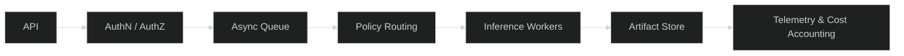
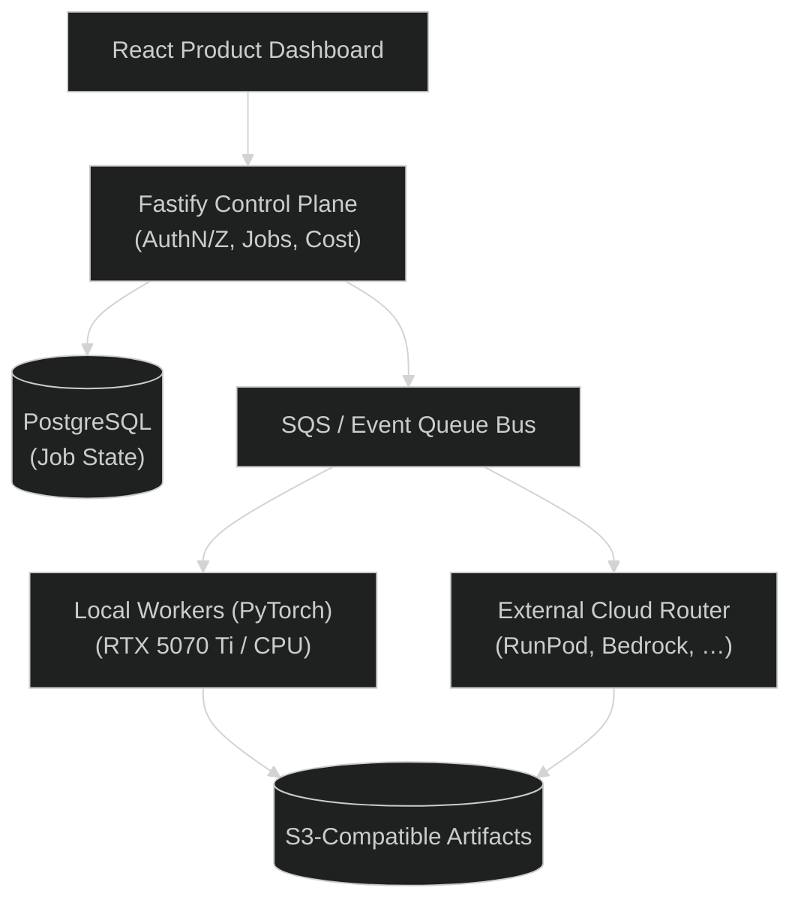

# Multi-Tenant AI Inference Platform

A production-oriented reference platform demonstrating the complete lifecycle of asynchronous, multi-tenant AI inference workloads:



Engineered for architectural coherence, measurable performance, strict tenant boundary enforcement, and reproducible local/cloud deployment.

---

## Architecture Overview



### Core Tenets

1. **Evidence Over Claims**: Every claimed capability is verified via reproducible benchmarks, load tests, or automated isolation tests. No fabricated metrics.
2. **Provider-Agnostic Core**: Business logic and contracts depend on port abstractions, not specific vendor SDKs. Cloud and local share identical contracts.
3. **Local-First, Cloud-Verifiable**: Complete functional stack runs locally without requiring paid cloud infrastructure or proprietary emulators. GPU tasks have local acceleration fallback.
4. **Strict Multi-Tenancy**: Tenant boundary enforcement at the database, queue, storage, and telemetry layers.

---

## Technology Stack

| Domain | Technology | Rationale |
|---|---|---|
| **Control Plane** | TypeScript / Fastify (`pnpm`) | High throughput, strict schema validation, deterministic error handling |
| **Inference Engine** | Python / PyTorch (`uv`) | Ecosystem standard for model lifecycle and hardware acceleration |
| **Product UI** | React + TypeScript + React Flow | Job inspector, tenant economics, and routing explanation |
| **Operational Storage** | PostgreSQL | Transactional state transitions, tenant-scoped schemas/indexes |
| **Artifact Storage** | S3-compatible (MinIO / AWS S3) | Standardized payload & model artifact isolation |
| **Queue / Scheduling** | SQS-compatible abstraction / KEDA | Decoupled asynchronous job lifecycle with DLQ & backoff |
| **Telemetry** | OpenTelemetry · Prometheus · Grafana | End-to-end tracing (`request → job → worker → artifact`) |
| **Container & Cloud** | Docker Compose · Kubernetes (Helm) · Terraform | Local parity transitioning to reproducible AWS infrastructure |

---

## Repository Structure

This repository is organized as an incremental monorepo:

```text
├── .agents/                 # AI agent operating rules, skills, and milestone specs
│   ├── milestones/          # Sequential milestones (M00 to M12)
│   └── skills/              # Specialized domain instructions (OTel, PyTorch, K8s, etc.)
├── apps/                    # Control plane API, inference worker, dashboard (M02+)
├── packages/                # Shared contracts, types, and provider adapters (M02+)
├── infrastructure/          # Terraform modules & AWS configuration (M07+)
├── deploy/                  # Docker Compose, Helm charts, and Argo CD manifests (M02, M06, M10)
├── benchmarks/              # Reproducible performance harnesses (M04, M12)
├── tests/                   # End-to-end and tenant isolation test suites (M02+)
├── docs/                    # Architecture diagrams and Architecture Decision Records (ADRs) (M01+)
├── AGENTS.md                # Top-level operating manual for automated pair-programming
├── LICENSE                  # Apache 2.0 License
└── README.md
```

---

## Development Roadmap

Implementation proceeds in disciplined, incremental milestones. Each milestone is validated against explicit acceptance criteria and automated checks before merging:

| Milestone | Title | Focus |
|---|---|---|
| **M00** | GitHub Foundation | Monorepo layout, pre-commit validation, secret scanning, and CI gate |
| **M01** | Architecture & ADRs | Formal contracts, tenancy model, and durable technical decisions |
| **M02** | Local Platform Skeleton | Containerized local runtime (Fastify, PostgreSQL, S3 mock, Queue) |
| **M03** | Async Inference Lifecycle | Idempotent job handling, exponential backoff, DLQ, and cancellation |
| **M04** | GPU Inference & Benchmarks | PyTorch worker, GPU telemetry, and reproducible performance harness |
| **M05** | Observability | OpenTelemetry distributed tracing and Grafana operational dashboards |
| **M06** | Kubernetes Scheduling | Helm packaging, KEDA queue autoscaling, and batch admission |
| **M07** | AWS Cloud Platform | Terraform infrastructure, least-privilege IAM, and cost guardrails |
| **M08** | Provider Policy Routing | Dynamic routing between local compute, RunPod, Bedrock, and SageMaker |
| **M09** | Multi-Tenant Security | ABAC, tenant isolation test suites, and supply chain controls |
| **M10** | GitOps & Continuous Delivery | Argo CD synchronization, environment promotion, and OIDC pipelines |
| **M11** | Product Dashboard | Workload path visualization, tenant margins, and routing inspectability |
| **M12** | Production Readiness | Comprehensive failure injection, load verification, and final evidence |

---

## AI-Assisted Engineering Process

This project is built using disciplined agentic pair-programming governed by:
- **[AGENTS.md](AGENTS.md)**: Session-scoped execution constraints, non-fabrication rules, and boundary safety.
- **[Milestone Protocol](.agents/README.md)**: Strict context boundaries preventing cross-milestone scope creep and ensuring traceable, incremental development.
- **Durable Decisions (ADRs)**: Technical choices are justified with constraints and alternatives before implementation.

---

## Getting Started

### Prerequisites

- **Make**: Standard build automation tool
- **Node.js 22+ & pnpm 12+**: Fastify control plane API runtime and workspace package manager
- **Python 3.11+**: Base runtime for validation scripts and tests
- **Docker & Docker Compose**: Local platform runtime (PostgreSQL 16, MinIO, ElasticMQ)
- **Gitleaks**: Fast credential detection tool ([Installation guide](https://github.com/gitleaks/gitleaks))

### First Steps & Local Development

1. **Install workspace dependencies**:
   ```bash
   pnpm install
   pnpm build
   ```

2. **Option A: Start full platform via Docker Compose**:
   ```bash
   # Starts PostgreSQL, MinIO (S3), ElasticMQ (SQS), and Fastify API in Docker
   docker compose up -d

   # Verify all services are healthy
   docker compose ps
   ```

3. **Option B: Local development loop (API on host with hot-reload)**:
   ```bash
   # Start only backing infrastructure
   docker compose up -d postgres minio elasticmq

   # Start Fastify API with hot-reload
   cd apps/api
   pnpm dev
   ```

4. **Execute end-to-end workload cycles**:
   Open [`request.rest`](request.rest) in VS Code with the REST Client extension (`humao.rest-client`) to execute sequential Use Case Cycles (health checks, job submission, idempotency, lifecycle simulation, and cancellation).

### Local Validation Gate

Run the full local CI gate before submitting pull requests or committing code:

```bash
# Run all checks: formatting, linting, types, unit tests, secrets/PII, and milestone handoff
make ci
```

Individual validation targets:
```bash
make format-check    # Check line endings, trailing whitespace, and EOF newlines
make lint            # Check Python and JSON syntax compilation
make typecheck       # Validate type annotations
make test            # Run automated test suites
make scan            # Run Gitleaks and PII pattern scanning
make handoff-check   # Validate milestone protocol compliance (.agents/README.md)
make install-hooks   # Configure local Git repository to run pre-commit hook
```

### Pre-Commit Secret Scanning

This repository strictly enforces secret prevention:
```bash
# Verify Gitleaks installation
gitleaks version

# Run standalone detection against repository
gitleaks detect --source=. --config=.gitleaks.toml --no-git --verbose
```

---

## License

Licensed under the Apache License, Version 2.0. See [LICENSE](LICENSE) for details.

