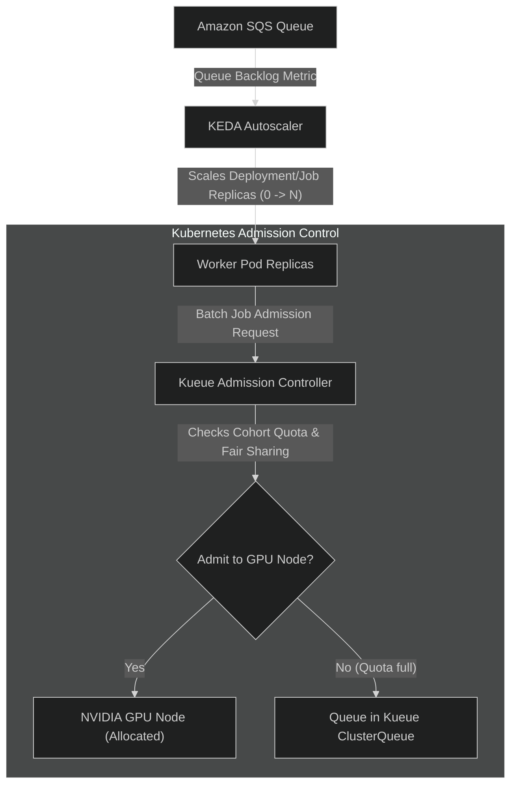

# ADR-0008: Delineate Responsibilities: KEDA for Queue Autoscaling vs Kueue for Batch Admission

- **Status**: Accepted
- **Date**: 2026-10-09
- **Deciders**: Architecture Team

---

## Context & Problem Statement

In Kubernetes-based AI workload environments, managing expensive GPU resources requires two distinct capabilities:
1. Scaling worker pods dynamically in response to incoming job backlog to minimize idle cloud spend while handling burst traffic.
2. Governing fair admission of heavy, batch-oriented GPU workloads to prevent cluster saturation, GPU out-of-memory (OOM) faults, and unfair tenant starvation.

Tools like KEDA (Kubernetes Event-driven Autoscaling) and Kueue (Kubernetes batch queuing and quota admission) both address workload scheduling, but operating them together without distinct boundaries risks conflicting lifecycle actions.

## Decision Drivers

- Avoid conflicts between pod scaling controllers and batch admission controllers.
- Support scale-to-zero when no inference jobs are queued.
- Prevent multi-tenant resource starvation on shared GPU clusters.
- Maintain clarity on pod lifecycle management.

## Considered Options

1. **Explicit separation: KEDA owns horizontal pod autoscaling based on queue depth; Kueue owns batch admission and tenant quota queueing**
2. **KEDA only (no Kueue)**
3. **Kueue only (no KEDA)**
4. **Custom in-house controller**

## Decision Outcome

**Chosen option: Explicit separation of responsibilities between KEDA and Kueue**.

### Division of Responsibilities

1. **KEDA's Responsibility**:
   - Observes external SQS metrics (`ApproximateNumberOfMessagesVisible`).
   - Dynamically scales worker Deployment or Job replicas from 0 up to configured maximums based on queue backlog.
   - Triggers rapid scale-down to 0 when queues empty out, ensuring zero waste on idle GPU instances.

2. **Kueue's Responsibility**:
   - Manages cluster-level admission and tenant GPU resource quotas.
   - Intercepts batch jobs before they schedule onto GPU nodes to prevent thrashing or OOM errors.
   - Enforces fair sharing and priority borrowing between tenants sharing a single GPU pool.

## Consequences

- **Positive**:
  - Clean separation of concerns: KEDA bridges external cloud queues to Kubernetes pod counts; Kueue governs physical GPU allocation and fairness inside Kubernetes.
  - Workers scale to zero cleanly during lulls while large burst batches queue predictably without crashing nodes.
- **Negative / Trade-offs**:
  - Two Kubernetes operators to maintain and monitor in cloud clusters (introduced when reaching Kubernetes milestone M06).

