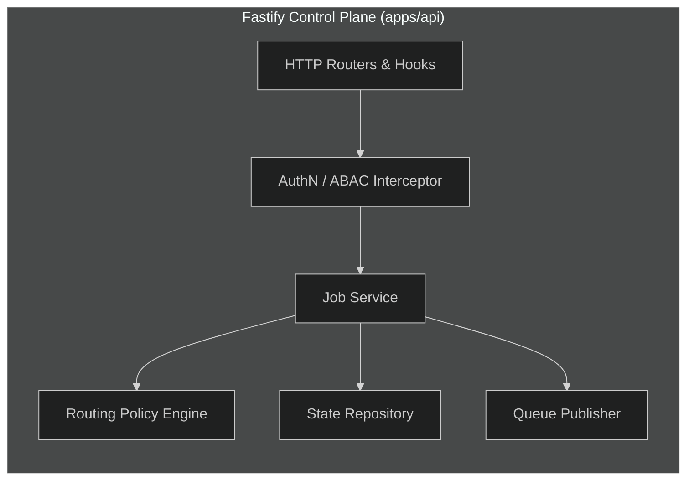
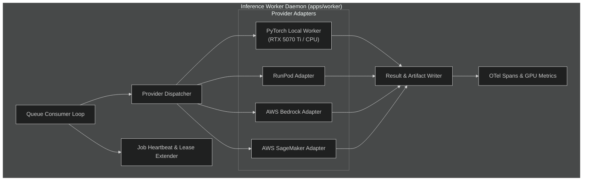

# Component Architecture

This document specifies the internal decomposition, responsibilities, and structural boundaries of the components within the **Multi-Tenant AI Inference Platform**.

---

## 1. Fastify Control Plane (`apps/api`)

The Control Plane serves as the single entry point for client applications and operators. It handles request ingestion, authentication, authorization, quota validation, job state management, and asynchronous dispatch.

### Module Responsibilities

1. **HTTP Routers & Hooks (`apps/api/src/routes`)**:
   - Exposes RESTful endpoints for job submission (`POST /v1/jobs`), status inspection (`GET /v1/jobs/:id`), artifact retrieval (`GET /v1/jobs/:id/artifacts`), cancellation (`POST /v1/jobs/:id/cancel`), and health checks (`GET /healthz`).
   - Validates all request schemas using JSON Schema / TypeBox with strict validation rules.
   - Enforces uniform error formats based on RFC 7807 (Problem Details for HTTP APIs).

2. **AuthN & Tenant ABAC Interceptor (`apps/api/src/auth`)**:
   - Extracts and validates tenant credentials (API keys, JWT bearer tokens).
   - Resolves tenant context: `tenant_id`, allowed models, quota tier, and authorization policies.
   - Injects tenant context into the Fastify request context for downstream query scoping.

3. **Job Service (`apps/api/src/services/jobs`)**:
   - Implements idempotent job submission semantics via client-supplied `Idempotency-Key` headers.
   - Transitions job status from initial validation to `PENDING`.
   - Generates presigned S3 upload URLs for client input payloads exceeding 256 KB.

4. **Routing Policy Engine (`apps/api/src/routing`)**:
   - Evaluates tenant constraints, required model hardware (e.g., GPU memory, precision), latency targets, and cost budgets.
   - Assigns target routing target: `local`, `runpod`, `bedrock`, or `sagemaker`.
   - Emits target queue destination and routing metadata into the job payload.

5. **State Repository (`apps/api/src/db`)**:
   - Performs ACID transactions against PostgreSQL.
   - Enforces tenant isolation predicates on all SQL operations (`WHERE tenant_id = $1`).

6. **Queue Publisher (`apps/api/src/queue`)**:
   - Publishes jobs to SQS-compatible message queues with exponential backoff visibility attributes.

---

## 2. Python Inference Worker (`apps/worker`)

The Inference Worker is a distributed daemon built in Python that consumes jobs from the asynchronous queue, executes inference using PyTorch or delegates to cloud provider APIs, and records results.

### Module Responsibilities

1. **Queue Consumer Loop (`apps/worker/consumer.py`)**:
   - Polls SQS-compatible queues with configurable batch size and long-polling timeout.
   - Manages message visibility timeouts to prevent double-processing.
   - Implements graceful shutdown traps (SIGTERM/SIGINT) to finish in-flight jobs before pod termination.

2. **Job Heartbeat & Lease Manager (`apps/worker/heartbeat.py`)**:
   - While long-running inference proceeds, periodically extends message visibility on SQS and updates `heartbeat_at` in PostgreSQL.
   - Prevents stale job re-delivery when tasks take minutes to process.

3. **Provider Dispatcher (`apps/worker/dispatcher.py`)**:
   - Inspects job routing metadata and delegates execution to the registered `InferenceProvider` instance.
   - Handles transient provider failures with retry policies, or escalates to fallback providers if configured.

4. **PyTorch Local Worker (`apps/worker/providers/local.py`)**:
   - Loads weights into host GPU VRAM (RTX 5070 Ti) or CPU RAM using Hugging Face / TorchScript / safetensors.
   - Implements KV-caching, dynamic batching, and memory arena management.
   - Collects per-token latency and memory consumption metrics.

5. **Cloud Provider Adapters (`apps/worker/providers/{runpod,bedrock,sagemaker}.py`)**:
   - Marshals standard inference requests into vendor-specific payloads.
   - Translates vendor responses into platform-standard output contracts.

6. **Result Writer & Artifact Manager (`apps/worker/artifacts.py`)**:
   - Stores output embeddings, token streams, or generated media into S3 under tenant-partitioned prefixes.
   - Writes completion status, execution latency, token counts, and cost metrics to PostgreSQL.

---

## 3. Product Dashboard (`apps/dashboard`)

The Product Dashboard provides multi-tenant visibility for developers and operators:

- **Workload Inspector**: Real-time listing and status tracking of active and historical inference jobs.
- **Inference Path Visualizer (React Flow)**: Interactive DAG visualization showing the route taken by a job (Queue → Worker Adapter → S3 Artifacts).
- **Tenant Economics & Quota**: Per-tenant aggregated token consumption, provider cost accounting, and remaining rate limits.
- **Operational Metrics**: Embeds Grafana dashboards for cluster-level VRAM utilization, queue depth, and p95 latencies.

---

## 4. Shared Packages (`packages/`)

To prevent code duplication and enforce contract fidelity between TypeScript and Python, core schemas and contracts reside in centralized packages:

- **`packages/contracts`**:
  - Contains canonical JSON Schema specifications for API requests, queue message envelopes, provider contracts, and error responses.
  - Generates TypeScript types via `json-schema-to-typescript` and Python models via `pydantic`.
- **`packages/telemetry`**:
  - OpenTelemetry configuration helpers, semantic attribute constants, and trace-context propagation helpers.

