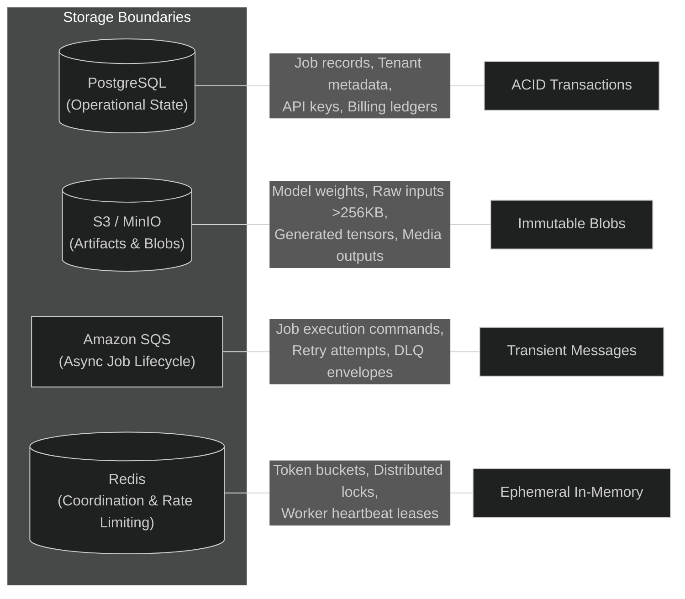

# Data Ownership Model

This document outlines the data storage architecture, state boundaries, ownership semantics, and retention policies of the **Multi-Tenant AI Inference Platform**.

---

## 1. Data Store Responsibilities

To avoid ambiguous persistence layers and data duplication, each storage technology owns a single domain concern:



| Data Concern | Primary Technology | Single Writer | Readers | Durability Guarantee |
|---|---|---|---|---|
| **Tenant & User Profiles** | PostgreSQL | Control Plane API | API, Workers | Durable, Multi-AZ transactional |
| **Job Lifecycle State** | PostgreSQL | Control Plane API & Worker | API, Dashboard | Durable, ACID, strict state machine |
| **Job Payloads & Tensors** | S3 / MinIO | Client (presigned) / Worker | Worker, Client | Durable, Content-addressed blobs |
| **Asynchronous Job Dispatch**| Amazon SQS | Control Plane API | Worker | High-throughput, At-least-once |
| **Rate Limits & API Leases** | Redis | Control Plane API | API | Ephemeral, Volatile (TTL enforced) |
| **Worker Health Leases** | Redis / PostgreSQL | Worker | API, Autoscaler | Ephemeral, Heartbeat with TTL |
| **Observability & Metrics** | Prometheus / OTel | OTel Collector | Grafana, Dashboard | Time-series, 15–30 day rolling retention |

---

## 2. Operational State: PostgreSQL

PostgreSQL serves as the authoritative source of truth for all business entities, authentication credentials, job transitions, and tenant billing meters.

### Core Tables & Ownership

1. **`tenants`**:
   - Fields: `id` (UUID), `name`, `tier` (`free`, `standard`, `enterprise`), `created_at`, `status`.
   - Single Writer: Platform Administrative API.
2. **`api_keys`**:
   - Fields: `id`, `tenant_id`, `key_hash` (Argon2id/SHA-256), `scopes`, `revoked_at`, `expires_at`.
   - Single Writer: Tenant Auth Management.
3. **`jobs`**:
   - Fields: `id` (UUID), `tenant_id`, `idempotency_key`, `model_id`, `provider`, `status` (`PENDING`, `QUEUED`, `PROCESSING`, `SUCCEEDED`, `FAILED`, `CANCELLED`), `priority`, `input_uri`, `output_uri`, `error_code`, `error_message`, `duration_ms`, `tokens_in`, `tokens_out`, `cost_microcents`, `retry_count`, `created_at`, `started_at`, `completed_at`.
   - Writers: Control Plane initiates; Worker updates status, outputs, metrics upon completion.
   - Guard: Enforces monotonic state transitions via SQL constraints or explicit atomic CAS updates (`UPDATE jobs SET status = 'PROCESSING' WHERE id = $1 AND status = 'QUEUED'`).
4. **`tenant_quotas`**:
   - Fields: `tenant_id`, `max_concurrent_jobs`, `monthly_token_limit`, `current_month_tokens`, `rate_limit_rpm`.
   - Writers: Control Plane metering hooks.

---

## 3. Artifact Storage: S3-Compatible Storage

Raw inputs (prompts, images, documents) larger than 256 KB and all output artifacts (generated text files, embeddings, output images, model checkpoints) reside in S3-compatible object storage.

### Path Hierarchy & Tenant Isolation

Objects are strictly partitioned by tenant ID to guarantee that presigned URLs and IAM bucket policies cannot leak cross-tenant assets:

```text
s3://<bucket-name>/
├── tenants/
│   ├── <tenant_id>/
│   │   ├── inputs/
│   │   │   └── <job_id>/input.json
│   │   └── outputs/
│   │       └── <job_id>/
│   │           ├── result.json
│   │           └── output.bin
├── models/
│   └── <model_id>/
│       └── weights.safetensors
└── shared/
    └── ...
```

### Presigned URL Flow

- For inputs `> 256 KB`, the Fastify API generates an S3 Presigned `PUT` URL restricted to `tenants/<tenant_id>/inputs/<job_id>/*` with a 15-minute expiration.
- The client uploads directly to S3 before triggering job processing.
- Completed outputs are accessed via S3 Presigned `GET` URLs generated on-demand by the API for authorized tenant clients.

---

## 4. Message Queue: SQS-Compatible Queue

The message queue coordinates async job scheduling:

- **Message Envelope**: Contains `job_id`, `tenant_id`, `model_id`, `priority`, `traceparent`, and `routing_target`. Large payloads are referenced via S3 URIs, never embedded directly in the message.
- **Visibility Timeout**: Defaults to 300 seconds. Extended proactively by worker heartbeats for long-running inferences.
- **Dead-Letter Queue (DLQ)**: Configured with `maxReceiveCount = 3`. Poison pills or crash-looping tasks are quarantined for inspection.

---

## 5. Ephemeral State: Redis Boundaries

Redis is explicitly restricted to performance-sensitive, ephemeral operations where persistence is non-critical:

- **Token Bucket Rate Limiting**: Tracking request counts per tenant API key per minute window.
- **Deduplication / Idempotency Cache**: Fast-path cache of recently submitted `Idempotency-Key` headers (backed durably by PostgreSQL unique constraint).
- **Worker Heartbeat Tracking**: Fast key expiry (`SET worker:<id>:heartbeat EX 15`) for health detection.

> [!CAUTION]
> Redis is **never** used as a primary database for job states, billing records, or long-term operational data. If Redis experiences data loss or node replacement, the platform resumes cleanly from PostgreSQL.
