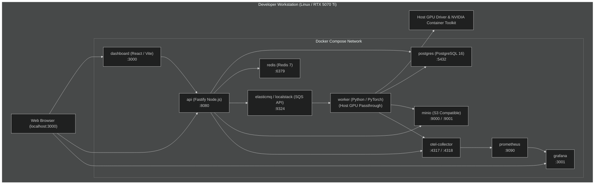
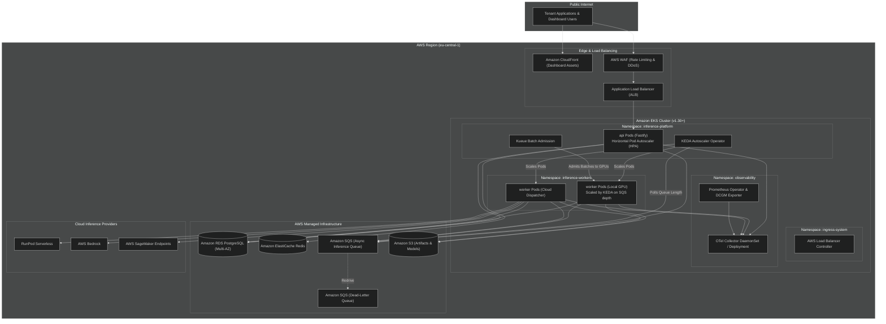

# Deployment Topology

This document details the physical and orchestration topologies for both local development and cloud production deployments of the **Multi-Tenant AI Inference Platform**.

---

## 1. Local Development Topology (Docker Compose)

The local environment provides full architectural fidelity without requiring active cloud credentials or paid managed services. All services run within Docker Compose, with optional hardware passthrough for host GPU acceleration.

### Local Dev Port Allocation

| Service | Internal Port | Host Port | Purpose |
|---|---|---|---|
| `dashboard` | 3000 | 3000 | React Product Dashboard |
| `api` | 8080 | 8080 | Fastify Control Plane API |
| `grafana` | 3000 | 3001 | Operational Monitoring Dashboards |
| `postgres` | 5432 | 5432 | Primary Relational Database |
| `redis` | 6379 | 6379 | Ephemeral State & Cache |
| `minio` | 9000, 9001 | 9000, 9001 | S3 API & MinIO Console |
| `elasticmq` | 9324 | 9324 | SQS-Compatible Message Queue |
| `prometheus` | 9090 | 9090 | Prometheus Metrics Storage |
| `otel-collector` | 4317, 4318 | 4317, 4318 | OTel gRPC / HTTP Ingestion |

---

## 2. Cloud Production Topology (AWS EKS & Managed Services)

The cloud production topology targets AWS using Amazon Elastic Kubernetes Service (EKS) managed with Terraform and reconciled via Argo CD. Stateless API and worker components run inside EKS, while stateful tiers rely on managed AWS infrastructure.

---

## 3. Kubernetes Autoscaling Architecture

The platform separates real-time API scaling from heavy batch/inference scaling:

1. **Control Plane Scaling**:
   - `api` pods scale via standard Kubernetes Horizontal Pod Autoscaler (HPA) based on CPU and HTTP request rates.
2. **Worker Queue-Depth Autoscaling (KEDA)**:
   - Inference workers scale from 0 to N replicas using KEDA (Kubernetes Event-driven Autoscaling) measuring SQS queue depth (`ApproximateNumberOfMessagesVisible`).
   - Enables rapid scale-out during batch bursts and scale-to-zero when queues are idle to prevent idle GPU compute costs.
3. **Batch Admission & Fair Sharing (Kueue)**:
   - Multi-tenant GPU quota sharing and queuing are managed by Kueue.
   - Prevents GPU out-of-memory (OOM) faults by queuing workload admissions rather than allowing uncontrolled concurrent pod launches.

