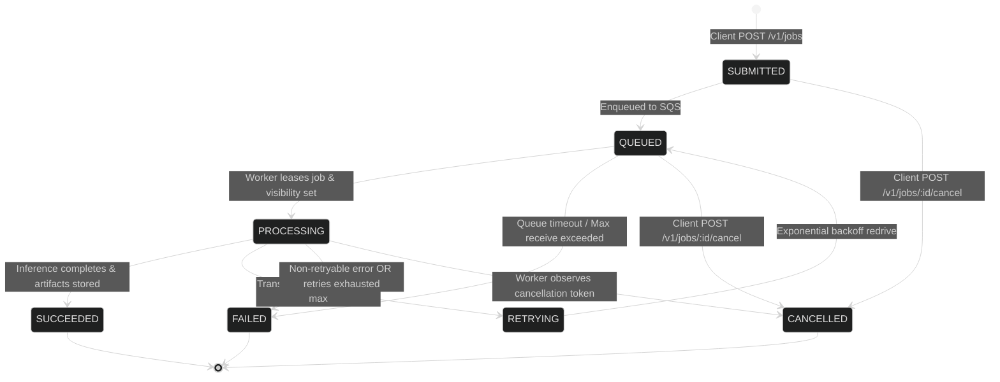

# API & Job Lifecycle Contract

This document formalizes the HTTP API contracts, asynchronous job lifecycle state machine, JSON schema payloads, idempotency rules, and failure semantics for the **Multi-Tenant AI Inference Platform**.

---

## 1. Job Lifecycle State Machine

An inference job transitions through well-defined lifecycle states. State mutations are monotonic and atomic.



### State Definitions

| State | Type | Description |
|---|---|---|
| `SUBMITTED` | Ephemeral | Received and validated by Control Plane API; written to PostgreSQL. |
| `QUEUED` | Active | Job envelope published to message broker; awaiting worker pickup. |
| `PROCESSING`| Active | Worker leased job, heartbeat active, model executing inference. |
| `RETRYING` | Active | Transient provider error; delayed backoff before re-queueing. |
| `SUCCEEDED` | Terminal | Execution completed; results and artifacts persisted in S3. |
| `FAILED` | Terminal | Permanent execution failure, invalid parameters, or exhausted retries. |
| `CANCELLED` | Terminal | Explicitly terminated by client request before or during execution. |

---

## 2. REST API Endpoints

All endpoints require authentication via Bearer token: `Authorization: Bearer <tenant_api_key>`.

### 2.1 Submit Inference Job
- **Method**: `POST /v1/jobs`
- **Headers**:
  - `Content-Type: application/json`
  - `Idempotency-Key: <unique-uuid-or-hash>` (Optional but recommended)
- **Status Codes**:
  - `202 Accepted`: Job accepted for asynchronous execution.
  - `200 OK`: Idempotent replay of an existing job submission.
  - `400 Bad Request`: Validation failure.
  - `401 Unauthorized`: Invalid or missing credentials.
  - `429 Too Many Requests`: Rate limit or concurrency quota exceeded.

#### Request Payload Schema
```json
{
  "$schema": "https://json-schema.org/draft/2020-12/schema",
  "title": "JobSubmissionRequest",
  "type": "object",
  "required": ["model_id", "input"],
  "properties": {
    "model_id": {
      "type": "string",
      "description": "Target model identifier (e.g., meta-llama/Llama-3-8B-Instruct, stable-diffusion-v1-5)"
    },
    "routing_preference": {
      "type": "string",
      "enum": ["auto", "local", "cloud", "cost_optimized", "low_latency"],
      "default": "auto"
    },
    "priority": {
      "type": "integer",
      "minimum": 1,
      "maximum": 10,
      "default": 5
    },
    "input": {
      "type": "object",
      "description": "Inference input parameters. If >256KB, use presigned upload flow.",
      "properties": {
        "prompt": { "type": "string" },
        "parameters": {
          "type": "object",
          "properties": {
            "max_new_tokens": { "type": "integer", "default": 512 },
            "temperature": { "type": "number", "minimum": 0.0, "maximum": 2.0, "default": 0.7 },
            "top_p": { "type": "number", "minimum": 0.0, "maximum": 1.0, "default": 0.9 }
          }
        }
      },
      "required": ["prompt"]
    },
    "input_uri": {
      "type": "string",
      "format": "uri",
      "description": "S3 URI to presigned input blob if uploaded directly."
    }
  }
}
```

#### Response Payload (202 Accepted)
```json
{
  "job_id": "9b1deb4d-3b7d-4bad-9bdd-2b0d7b3dcb6d",
  "status": "QUEUED",
  "model_id": "meta-llama/Llama-3-8B-Instruct",
  "created_at": "2026-10-09T14:30:00Z",
  "poll_url": "/v1/jobs/9b1deb4d-3b7d-4bad-9bdd-2b0d7b3dcb6d"
}
```

---

### 2.2 Get Job Status & Result
- **Method**: `GET /v1/jobs/:id`
- **Response (200 OK - Terminal Succeeded)**:
```json
{
  "job_id": "9b1deb4d-3b7d-4bad-9bdd-2b0d7b3dcb6d",
  "status": "SUCCEEDED",
  "model_id": "meta-llama/Llama-3-8B-Instruct",
  "provider": "local_pytorch",
  "created_at": "2026-10-09T14:30:00Z",
  "started_at": "2026-10-09T14:30:01Z",
  "completed_at": "2026-10-09T14:30:04Z",
  "duration_ms": 3120,
  "usage": {
    "prompt_tokens": 42,
    "completion_tokens": 128,
    "total_tokens": 170,
    "cost_microcents": 850
  },
  "result": {
    "output_text": "Antigravity is an AI pair programmer designed for rigorous software engineering.",
    "finish_reason": "stop"
  },
  "artifacts": [
    {
      "name": "full_output",
      "download_url": "https://storage.local/tenants/t-123/outputs/9b1deb4d.../result.json?expires=..."
    }
  ]
}
```

---

### 2.3 Cancel In-Flight Job
- **Method**: `POST /v1/jobs/:id/cancel`
- **Status Codes**:
  - `200 OK`: Job marked cancelled.
  - `409 Conflict`: Cannot cancel job in terminal state (`SUCCEEDED`, `FAILED`).

---

## 3. Idempotency Contract

Clients pass `Idempotency-Key` headers on job creation.
1. The Control Plane checks PostgreSQL / Redis for an existing record with matching `(tenant_id, idempotency_key)`.
2. If found within the 24-hour deduplication window:
   - Returns the existing `job_id` and status with HTTP `200 OK`.
   - Does not enqueue a duplicate task to the message broker.
3. If not found:
   - Persists the record and returns HTTP `202 Accepted`.

---

## 4. Uniform Error Responses (RFC 7807)

All non-2xx responses conform to RFC 7807:

```json
{
  "type": "https://api.platform.local/errors/quota-exceeded",
  "title": "Tenant Quota Exceeded",
  "status": 429,
  "detail": "Tenant 'acme-corp' has exceeded its monthly token limit of 10,000,000 tokens.",
  "instance": "/v1/jobs",
  "code": "TENANT_QUOTA_EXCEEDED",
  "timestamp": "2026-10-09T14:30:00Z"
}
```

