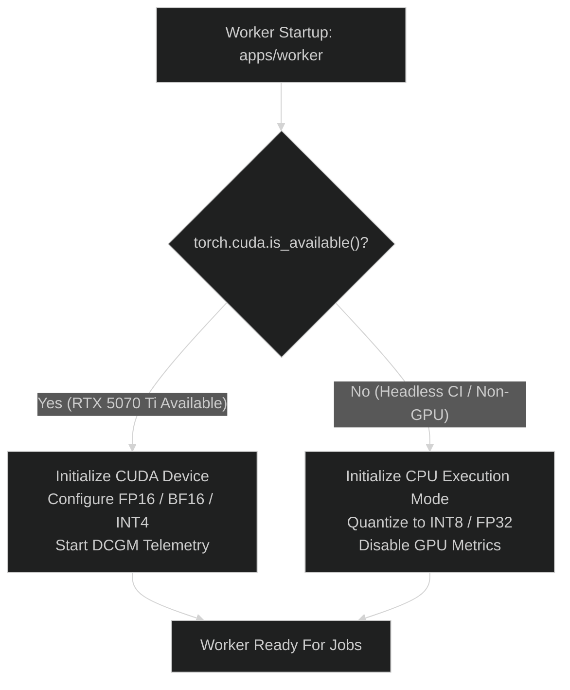

# Local-vs-Cloud Boundary & Environment Parity

This document defines the interface boundary between local developer environments and cloud deployments for the **Multi-Tenant AI Inference Platform**, ensuring zero architectural drift between local testing and production execution.

---

## 1. Local-First Engineering Philosophy

A core requirement from `AGENTS.md` is **Local-first, cloud-verifiable**:
- The default development and automated test path runs completely offline without paid cloud infrastructure, proprietary emulators, or mandatory GPU hardware.
- GPU acceleration is supported locally on developer workstations equipped with an NVIDIA RTX 5070 Ti, with seamless automated fallback to CPU inference for CI and headless environments.
- Business logic, REST endpoints, database schemas, and queue contracts are identical between local Docker Compose and Kubernetes/AWS EKS.

---

## 2. Infrastructure Parity Matrix

| Capability | Local Development | Cloud Production (AWS) | Contract Parity Strategy |
|---|---|---|---|
| **Control Plane Runtime** | Node.js 20+ via Docker Compose | Amazon EKS Pods (HPA) | Shared Fastify container image |
| **Relational Database** | PostgreSQL 16 (Container) | Amazon RDS PostgreSQL (Multi-AZ) | Shared SQL migrations via Knex / Drizzle / Flyway |
| **Object Storage** | MinIO (S3 API compatible) | Amazon S3 | AWS SDK v3 with endpoint override (`AWS_ENDPOINT_URL`) |
| **Async Message Queue** | ElasticMQ / SQS Mock (Container)| Amazon SQS | AWS SDK v3 SQS client with endpoint override |
| **Cache & Leases** | Redis 7 (Container) | Amazon ElastiCache Redis | Standard Redis RESP3 protocol client |
| **GPU Inference** | Host RTX 5070 Ti (16GB VRAM) | Cloud GPU Nodes (g5 / g6 instances) | Shared PyTorch worker container & CUDA driver API |
| **CPU Fallback** | PyTorch CPU / Mock Engine | CPU Worker Pods | Automated device detection: `cuda` -> `cpu` |
| **External Providers** | Mock Adapter / Record-Replay | AWS Bedrock, SageMaker, RunPod | Provider interface abstraction (`InferenceProvider`) |
| **Telemetry Ingestion** | Local OTel Collector + Prometheus | OTel DaemonSet + AWS CloudWatch | Shared OTel semantic conventions and exporter configs |

---

## 3. Provider Parity & Offline Mocking

When developing locally or running CI pipelines without external cloud credentials:

1. **Provider Mock Modes**:
   - `AWSBedrockAdapter`, `AWSSageMakerAdapter`, and `RunPodServerlessAdapter` support an explicit offline configuration flag (`PROVIDER_MOCK_MODE=true`).
   - In mock mode, adapters return synthetic token streams and deterministic responses according to realistic latency distributions (e.g., simulated 80ms TTFT and 30ms/token generation) without issuing network calls to AWS or RunPod.
2. **Deterministic Contract Testing**:
   - Contract test suites verify that real provider responses and mock adapter responses parse into identical `InferenceResult` structures.

---

## 4. Hardware Fallback Path (Local RTX 5070 Ti vs CPU)

To maintain friction-free local execution:

1. **GPU Mode**:
   - Detects CUDA capability (e.g., NVIDIA RTX 5070 Ti with compute capability 8.9+).
   - Allocates memory with `torch.cuda.set_per_process_memory_fraction(0.85)`.
   - Uses FlashAttention-2 or PyTorch SDPA (Scaled Dot-Product Attention) for accelerated inference.
2. **CPU Fallback Mode**:
   - Falls back gracefully to CPU inference using smaller model variants or quantized checkpoints.
   - Emits an informational log: `[WARN] CUDA unavailable. Initialized in CPU execution mode.`
   - No crash or startup blocker occurs.

