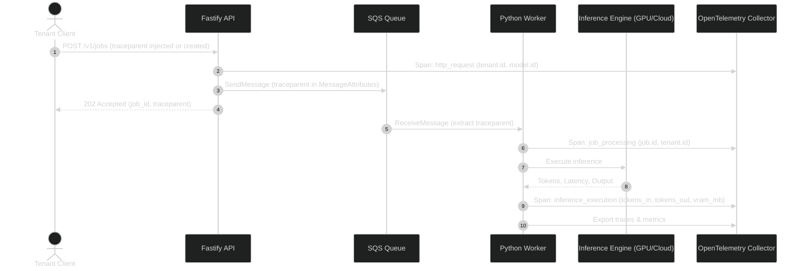

# Observability & Telemetry Model

This document specifies the distributed tracing standards, metric taxonomy, correlation identifiers, GPU telemetry, and per-tenant cost attribution models for the **Multi-Tenant AI Inference Platform**.

---

## 1. Unified Distributed Tracing (OpenTelemetry)

Every inference workload traverses a multi-step asynchronous pipeline. Distributed tracing links the entire journey using W3C TraceContext (`traceparent` header propagation).

---

## 2. Correlation Identifiers

All log lines, traces, and metrics must include consistent correlation attributes to enable seamless cross-system debugging:

| Attribute Name | OpenTelemetry Semantic Key | Description | Example |
|---|---|---|---|
| **Request ID** | `http.request_id` | Unique ID of the client HTTP call | `req-4a8f9c1b` |
| **Tenant ID** | `tenant.id` | Authenticated tenant account | `ten-alpha-99` |
| **Job ID** | `job.id` | Persistent UUID of the inference job | `9b1deb4d-...` |
| **Model ID** | `gen_ai.request.model` | Model requested | `meta-llama/Llama-3-8B-Instruct` |
| **Provider** | `gen_ai.system` | Execution backend | `local_pytorch`, `bedrock`, `runpod` |
| **Hardware** | `inference.device` | Execution device | `cuda:0`, `cpu`, `serverless` |

---

## 3. Metrics Taxonomy

Metrics follow Prometheus conventions and OpenTelemetry GenAI semantic conventions:

### 3.1 Control Plane Metrics
- `http_server_request_duration_seconds{tenant_id, route, status}`: Histogram of API ingress latency.
- `jobs_submitted_total{tenant_id, model_id}`: Counter of accepted submissions.
- `jobs_rejected_total{tenant_id, reason}`: Counter of rejected submissions (rate limit, quota, invalid schema).
- `queue_messages_visible{queue_name}`: Gauge of pending jobs in SQS (consumed by KEDA for scaling).

### 3.2 Worker & Inference Metrics
- `inference_job_duration_seconds{tenant_id, model_id, provider}`: End-to-end execution duration.
- `inference_token_generation_duration_seconds{model_id, provider}`: Time-to-first-token (TTFT) and inter-token latency.
- `inference_tokens_total{tenant_id, model_id, type="prompt"|"completion"}`: Total processed tokens for billing.
- `inference_cost_microcents_total{tenant_id, provider}`: Accumulated cost in 1/10,000 cents.
- `inference_job_retries_total{provider, error_type}`: Count of transient retries.
- `inference_job_dlq_total{queue_name}`: Count of exhausted jobs moved to Dead Letter Queue.

### 3.3 Hardware Telemetry (NVIDIA DCGM Exporter)
When running on local GPU (RTX 5070 Ti) or cloud GPU nodes:
- `DCGM_FI_DEV_GPU_UTIL`: Real-time percentage GPU computation engine utilization.
- `DCGM_FI_DEV_MEM_COPY_UTIL`: Memory bus saturation percentage.
- `DCGM_FI_DEV_FB_USED`: Framebuffer (VRAM) allocated in megabytes.
- `DCGM_FI_DEV_GPU_TEMP`: GPU core temperature in Celsius.
- `DCGM_FI_DEV_POWER_USAGE`: Real-time power draw in Watts.

---

## 4. Cost Accounting & Metering

1. **Micro-Cent Granularity**:
   - Token-based costs and cloud infrastructure seconds are tracked in integer **microcents** ($0.000001 USD) to prevent floating-point rounding discrepancies.
2. **Provider Cost Models**:
   - `local_pytorch`: Electricity + hardware depreciation proxy (fixed cost per GPU-hour allocated).
   - `runpod`: GPU-second rate + network ingress/egress.
   - `bedrock`: Published token rates (e.g., $3.00 / 1M prompt tokens, $15.00 / 1M output tokens).
   - `sagemaker`: Instance hourly rate / concurrency factor.
3. **Billing Rollup**:
   - Upon job completion, `cost_microcents` is atomically recorded on the job record and debited against the tenant's monthly quota ledger in PostgreSQL.

