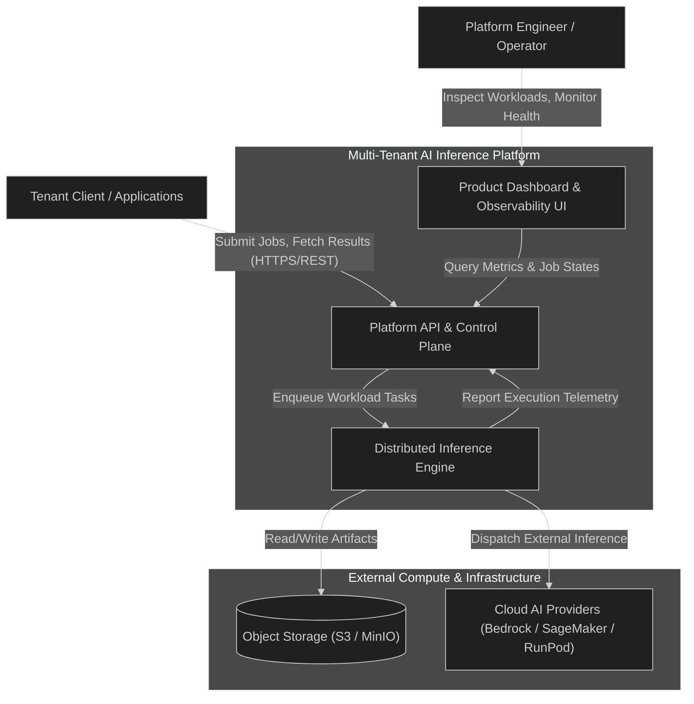
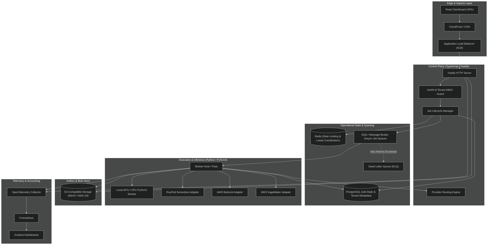

# Architecture Overview

This document provides the high-level system context, container architecture, and foundational principles for the **Multi-Tenant AI Inference Platform**. It serves as the primary entry point to the architecture documentation.

---

## 1. System Context

The platform provides a unified, multi-tenant control plane and distributed execution environment for asynchronous AI inference workloads. Clients submit inference requests specifying target models, inputs, and routing constraints. The platform guarantees strict tenant isolation, asynchronous job scheduling, provider-agnostic dispatch (local GPU, RunPod, AWS Bedrock, AWS SageMaker), deterministic state transitions, artifact persistence, and end-to-end observability with per-tenant cost attribution.

---

## 2. Container Architecture

The system is decomposed into decoupled services interacting via standardized contracts:

---

## 3. Core Architectural Principles

1. **Evidence Over Claims**: Every claimed capability (concurrency, cold start latencies, VRAM efficiency, isolation boundaries) must be verified through reproducible automated benchmarks, integration suites, and failure injection. No synthetic or assumed performance figures are accepted.
2. **Provider-Agnostic Core**: Workload orchestration, job state machines, billing accounting, and client contracts depend strictly on provider-agnostic port interfaces (`InferenceProvider`). Backend adapters (Local PyTorch, RunPod, Bedrock, SageMaker) implement identical lifecycle contracts.
3. **Local-First, Cloud-Verifiable**: Development, testing, and debugging run entirely offline using Docker Compose, PyTorch CPU/RTX fallback, MinIO, and queue mocks. Cloud deployment on Kubernetes and AWS validates the exact same contracts without introducing architectural divergence.
4. **Strict Multi-Tenant Isolation**: Tenancy boundaries are non-negotiable. Every database record carries tenant context enforced via Row-Level Security (RLS) or tenant predicate boundaries. S3 artifacts are strictly partitioned by tenant ID (`tenants/<tenant_id>/...`). Queues and logs preserve cryptographic tenant segregation.
5. **Decoupled Asynchronous Lifecycle**: Heavy computational tasks never execute synchronously in HTTP request loops. Fastify handles fast admission, payload ingestion, authentication, and enqueues jobs to SQS-compatible queues with durable delivery, idempotency tracking, exponential backoff, and DLQ handling.

---

## 4. Documentation Index

The architecture documentation is structured into the following focused specifications:

| Topic | Document | Focus |
|---|---|---|
| **Component Architecture** | [components.md](components.md) | Component responsibilities, internal interfaces, and boundaries. |
| **Deployment Topology** | [deployment-topology.md](deployment-topology.md) | Local Compose runtime vs. AWS EKS / Hybrid cloud staging and production. |
| **Data Ownership Model** | [data-ownership.md](data-ownership.md) | Storage categorization, retention policies, and single-writer boundaries. |
| **API & Job Contract** | [job-lifecycle-contract.md](job-lifecycle-contract.md) | REST endpoints, JSON schemas, job state machine, idempotency, and retries. |
| **Provider Abstraction** | [provider-abstraction.md](provider-abstraction.md) | Standard worker interface and provider adapter contracts. |
| **Tenancy & Security** | [tenancy-security.md](tenancy-security.md) | ABAC authentication, resource isolation, storage policies, and audit trails. |
| **Observability Model** | [observability.md](observability.md) | Distributed tracing, correlation IDs, metrics taxonomy, and GPU telemetry. |
| **Local-vs-Cloud Boundary** | [local-cloud-boundary.md](local-cloud-boundary.md) | Environment parity, mock behaviors, and hardware fallback paths. |
| **Architecture Decision Records** | [docs/adr/](../adr/README.md) | Durable architectural choices and evaluated alternatives. |

