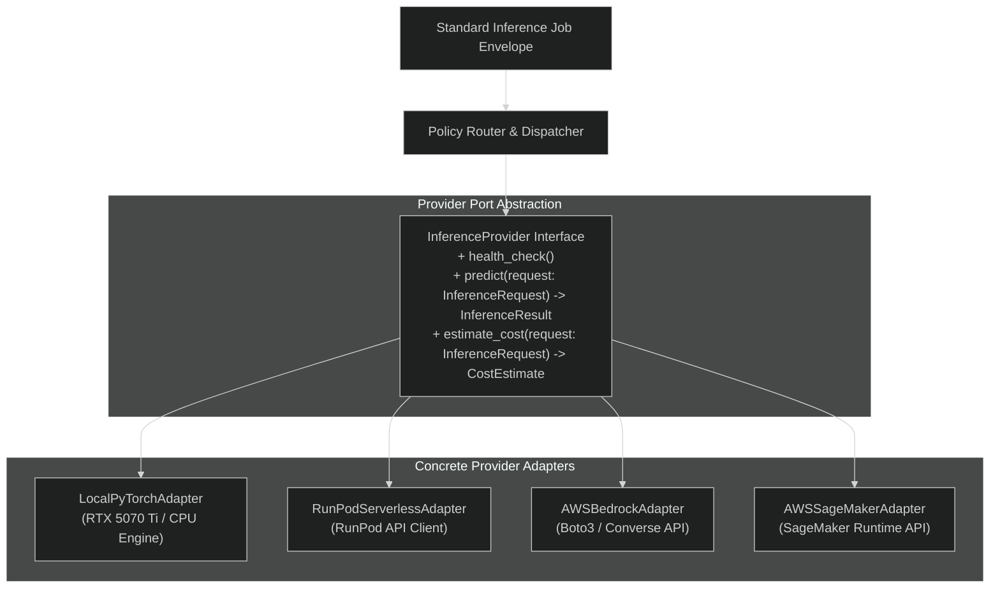
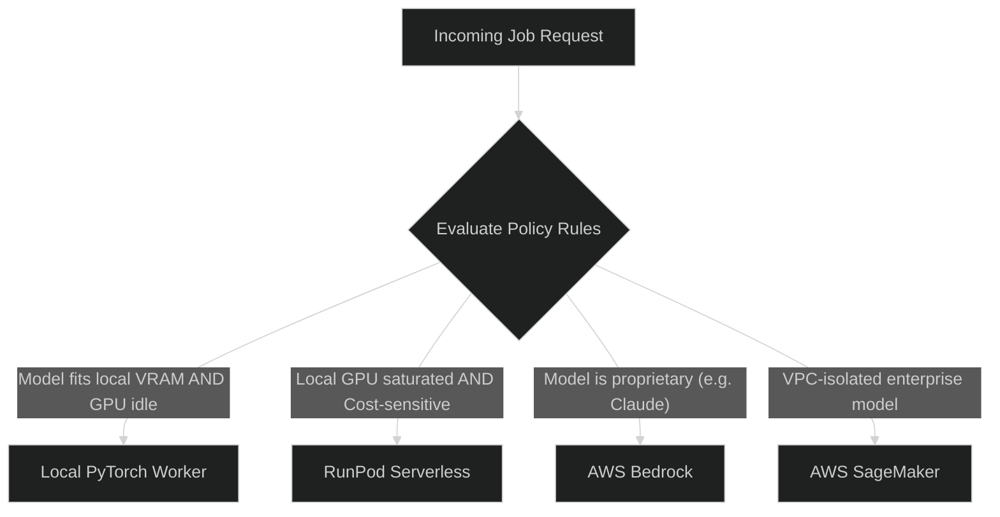

# Provider Abstraction & Adapter Architecture

This document defines the provider-agnostic port interface and adapter contracts enabling the **Multi-Tenant AI Inference Platform** to dispatch workloads interchangeably between local compute and cloud inference backends.

---

## 1. Architectural Motivation

A key tenet of the platform is **Provider-Agnostic Core**:
- High-level business logic (tenancy, billing, queue lifecycle, state transitions) must never bind directly to proprietary cloud SDKs (AWS Bedrock, SageMaker, or RunPod).
- Local execution (on developer workstations or on-premise RTX 5070 Ti GPUs) and cloud execution share identical interface contracts and telemetry signatures.



---

## 2. Standard Interface Definition

All backend adapters implement the `InferenceProvider` abstract base class (Python) or interface (TypeScript):

```python
from abc import ABC, abstractmethod
from typing import AsyncIterator, Optional
from pydantic import BaseModel

class InferenceRequest(BaseModel):
    job_id: str
    tenant_id: str
    model_id: str
    prompt: str
    parameters: dict
    stream: bool = False
    timeout_seconds: float = 300.0

class UsageMetrics(BaseModel):
    prompt_tokens: int
    completion_tokens: int
    total_tokens: int
    compute_duration_ms: float
    estimated_cost_microcents: int

class InferenceResult(BaseModel):
    output_text: str
    finish_reason: str
    usage: UsageMetrics
    provider_name: str
    raw_provider_response: Optional[dict] = None

class InferenceProvider(ABC):
    @property
    @abstractmethod
    def name(self) -> str:
        """Provider identifier: 'local_pytorch', 'runpod', 'bedrock', 'sagemaker'."""
        pass

    @abstractmethod
    async def is_healthy(self) -> bool:
        """Verify provider availability and connectivity."""
        pass

    @abstractmethod
    async def predict(self, request: InferenceRequest) -> InferenceResult:
        """Execute inference synchronously or wait on remote invocation."""
        pass

    @abstractmethod
    async def estimate_cost(self, request: InferenceRequest) -> int:
        """Return projected cost in microcents (1/10,000 cent) before dispatch."""
        pass
```

---

## 3. Concrete Adapters

### 3.1 Local PyTorch Adapter (`local_pytorch`)
- **Execution Target**: Dedicated worker process with direct CUDA / ROCm access or CPU fallback.
- **Model Loading**: Hugging Face Transformers, `vLLM` / `torch.compile` optimization, 4-bit / 8-bit quantized models (`bitsandbytes` / `AWQ`).
- **Telemetry**: Measures exact VRAM allocations via PyTorch CUDA APIs and tokens-per-second throughput.

### 3.2 RunPod Serverless Adapter (`runpod`)
- **Execution Target**: RunPod Serverless REST API endpoint.
- **Characteristics**: Low cold-start overhead for burst GPU compute; costs billed per active GPU-second.
- **Error Handling**: Detects queue timeout (`HTTP 408`) and automatically triggers retry or fallback.

### 3.3 AWS Bedrock Adapter (`bedrock`)
- **Execution Target**: Amazon Bedrock Foundation Models (Claude, Llama 3, Titan).
- **Billing Model**: Pure token-based billing (prompt tokens + completion tokens).
- **Authentication**: AWS IAM SigV4 via EKS IAM Roles for Service Accounts (IRSA).

### 3.4 AWS SageMaker Adapter (`sagemaker`)
- **Execution Target**: Amazon SageMaker Real-Time or Asynchronous Endpoints.
- **Characteristics**: Suitable for custom proprietary weights hosted within customer VPCs.

---

## 4. Policy-Based Routing

The routing engine dynamically selects the optimal adapter based on job criteria and tenant tier:



### Routing Strategies
- **`local_first` (Default)**: Attempts local execution on RTX 5070 Ti / local cluster. If VRAM is full or queue backlog exceeds threshold, overflows to RunPod.
- **`cost_optimized`**: Prefers lowest unit cost per 1k tokens among available healthy providers.
- **`low_latency`**: Routes to warmed endpoints with zero cold start.
- **`tenant_pinned`**: Enforces strict routing policies configured per tenant (e.g., enterprise data isolation constraints forbidding external cloud APIs).

