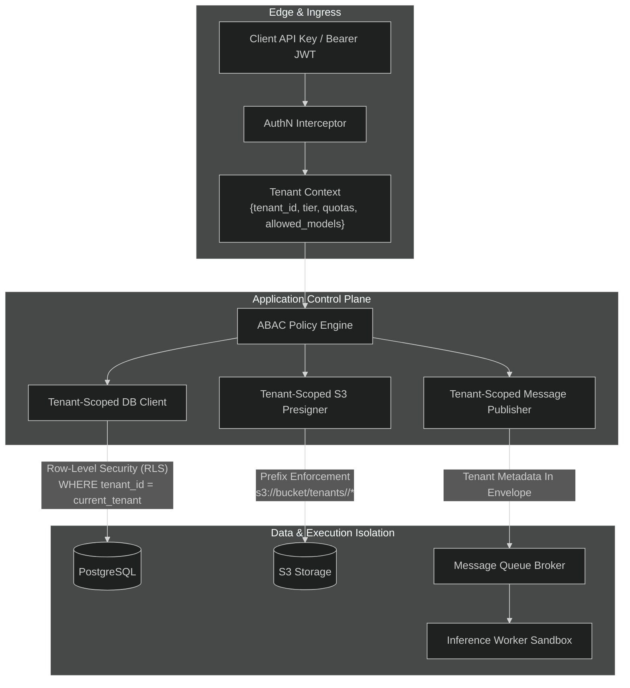

# Tenancy & Security Boundaries

This document defines the multi-tenant isolation model, authorization mechanisms, storage protection boundaries, and secret management standards for the **Multi-Tenant AI Inference Platform**.

---

## 1. Multi-Tenant Isolation Architecture

The platform implements **logical multi-tenancy with defense-in-depth**, ensuring data segregation, execution isolation, and cryptographic resource protection across shared infrastructure.



---

## 2. Authentication & Tenant Identification

1. **Client Identification**:
   - Every external HTTP request must present an API key (`Authorization: Bearer <key>`) or validated JWT.
   - API keys are hashed at rest using Argon2id/SHA-256 in the database.
   - Keys are associated with a specific `tenant_id`, expiration date, and scoped permissions (e.g., `jobs:submit`, `jobs:read`, `jobs:cancel`).

2. **Tenant Context Propagation**:
   - The Fastify auth hook decodes the credential and populates the request context:
     ```typescript
     interface TenantContext {
       tenantId: string;
       tier: 'free' | 'standard' | 'enterprise';
       allowedModels: string[];
       quotas: {
         maxConcurrentJobs: number;
         rateLimitRpm: number;
       };
     }
     ```
   - In distributed background tasks, `tenant_id` is propagated through SQS message attributes and OpenTelemetry trace spans.

---

## 3. Storage Layer Isolation

### 3.1 PostgreSQL Isolation (Row-Level Security & Queries)
- All operational tables (`jobs`, `api_keys`, `billing_records`) contain a non-nullable `tenant_id UUID` column with a B-tree index on `(tenant_id, created_at)`.
- Application queries enforce explicit `tenant_id` equality predicates.
- PostgreSQL Row-Level Security (RLS) is enabled as an architectural safety net:
  ```sql
  ALTER TABLE jobs ENABLE ROW LEVEL SECURITY;
  
  CREATE POLICY tenant_isolation_policy ON jobs
      FOR ALL
      USING (tenant_id = current_setting('app.current_tenant_id')::uuid);
  ```

### 3.2 S3 Object Storage Isolation
- Buckets enforce strict tenant prefixing: `s3://<bucket>/tenants/<tenant_id>/...`.
- Presigned URLs generated by the API restrict actions to the caller's specific tenant prefix:
  - `PUT` URLs restrict key, content length, and content type.
  - S3 IAM policies deny cross-tenant path traversals.

---

## 4. Execution Sandbox & Hardware Isolation

1. **Worker Task Separation**:
   - Inference workers process jobs as independent stateless tasks.
   - In-memory tenant contexts (e.g., prompt strings, model weights, intermediate activations) are scrubbed upon job completion or garbage-collected between worker processes.
   - For enterprise tenants requiring dedicated hardware isolation, Kueue schedules workloads to dedicated GPU node groups with Kubernetes taints and tolerations.

2. **Fair-Share Scheduling**:
   - Prevents noisy-neighbor starvation where a single tenant floods the queue.
   - The control plane checks per-tenant concurrent job counts in Redis / PostgreSQL before admitting new submissions.
   - If a tenant's in-flight jobs equal their tier's `max_concurrent_jobs`, subsequent submissions are held in `QUEUED` priority or rejected with HTTP `429`.

---

## 5. Secret Management & Compliance Boundaries

- **Zero Secrets in Source**: No API keys, database passwords, signing secrets, or private tokens are stored in Git.
- **Local Secret Injection**: In local development, Docker Compose reads secrets from local `.env` files (excluded by `.gitignore` and enforced by `make scan`).
- **Cloud Secret Injection**: In Kubernetes/AWS, secrets are injected via AWS Secrets Manager using External Secrets Operator or IAM Roles for Service Accounts (IRSA).
- **Audit Logging**: Every job submission, cancellation, key rotation, and quota update produces an append-only audit event containing `timestamp`, `tenant_id`, `actor_id`, `action`, and `ip_address`.

